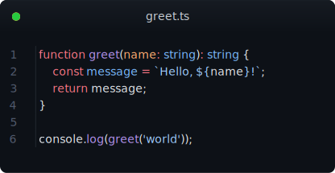

# @thesimonharms/code-shot

**MCP server that renders source code as beautiful images.** Perfect for AI agents to show code visually to humans on mobile devices, or for sharing syntax-highlighted snippets.

## Example



Generated from this TypeScript snippet with `theme: github-dark` and `title: greet.ts`:

```typescript
function greet(name: string): string {
  const message = `Hello, ${name}!`;
  return message;
}

console.log(greet('world'));
```

## Tools

### `render_code`

Render source code as SVG or PNG with full syntax highlighting.

| Param | Type | Default | Description |
|-------|------|---------|-------------|
| `code` | string | **required** | Source code to render |
| `language` | string | auto-detect | Language (ts, rust, py, go, js, and 40+ more) |
| `theme` | string | `github-dark` | Color theme (nord, dracula, catppuccin, one-dark-pro, etc.) |
| `title` | string | — | Window title bar text (e.g. filename) |
| `show_line_numbers` | boolean | `true` | Line number gutter |
| `font_size` | number | `14` | Font size in px |
| `output_format` | `svg\|png` | `svg` | SVG is crisp & copyable; PNG is raster |
| `width` | number | auto | Code area width in characters |
| `padding` | number | `16` | Padding in px |

### `render_diff`

Render a git unified diff with color-coded additions/deletions and **language-aware syntax highlighting**.

| Param | Type | Default | Description |
|-------|------|---------|-------------|
| `diff` | string | **required** | Unified diff content (`git diff` output) |
| `highlight_language` | string | auto-detect | Language for highlighting within hunks. Auto-detected from `diff --git` header (e.g. `file.ts` → TypeScript). Set to `"diff"` for plain diff highlighting. |
| ... | — | — | Same options as `render_code` |

Diff lines are highlighted with:
- `@@` hunk headers → blue background
- `+` additions → green background (`#1b4520` dark / `#dafbe1` light)
- `-` deletions → red background (`#4f1818` dark / `#ffebe9` light)

Syntax highlighting is applied per-hunk in the detected language — not just plain diff markup.

## Themes

18 bundled themes:

| Dark | Light |
|------|-------|
| github-dark | github-light |
| nord | one-light |
| one-dark-pro | material-theme-lighter |
| dracula | min-light |
| dracula-soft | solarized-light |
| catppuccin-mocha | catppuccin-latte |
| material-theme | vitesse-light |
| min-dark | — |
| solarized-dark | — |
| vitesse-dark | — |

## Test Suite

46 tests across two runners:

```
npm test    # Build → MCP integration tests (cobasaja) → Unit tests (node --test)
```

- **5 MCP integration tests** (`tests/code-shot.test.ts`) — tool discovery, rendering, error cases
- **37 unit tests** (`tests/*.node-test.ts`) — renderSvg structure, diffToLines parsing, guessLanguage heuristics

## Usage with Hermes

Add to `~/.hermes/config.yaml`:

```yaml
mcp_servers:
  code-shot:
    command: "npx"
    args: ["-y", "@thesimonharms/code-shot"]
```

Or from local build:

```yaml
mcp_servers:
  code-shot:
    command: "node"
    args: ["/path/to/code-shot/dist/index.js"]
```

## Configuration

Set defaults via `~/.code-shotrc` (JSON):

```json
{
  "theme": "nord",
  "show_line_numbers": true,
  "font_size": 14,
  "padding": 16
}
```

Also checked (in order): `~/.code-shotrc` > `~/.code-shotrc.json` > `~/.config/code-shot/config.json`.

Tool call arguments override config file values.

## Usage with Claude Code / Cursor

```json
{
  "mcpServers": {
    "code-shot": {
      "command": "node",
      "args": ["/path/to/code-shot/dist/index.js"]
    }
  }
}
```

## Development

```bash
npm install
npm run build    # tsc
npm test        # build + cobasaja + node --test
```

## How it works

1. **Shiki** tokenizes the code with full syntax highlighting (grammars for 40+ languages)
2. **SVG renderer** builds a pixel-perfect SVG with monospace positioning, window chrome, line numbers, and diff markers
3. **Optional PNG** via `@resvg/resvg-js` for platforms that don't support SVG natively
4. **Language auto-detection** via shebang parsing and code heuristics (18 language patterns)
5. **Diff language detection** from `diff --git a/file.ext b/file.ext` headers

No browser, no DOM, no headless Chromium — pure math-based SVG generation.

## License

MIT
